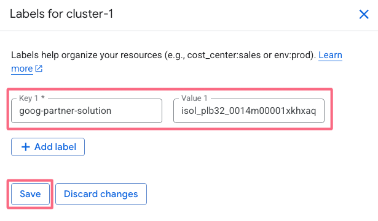
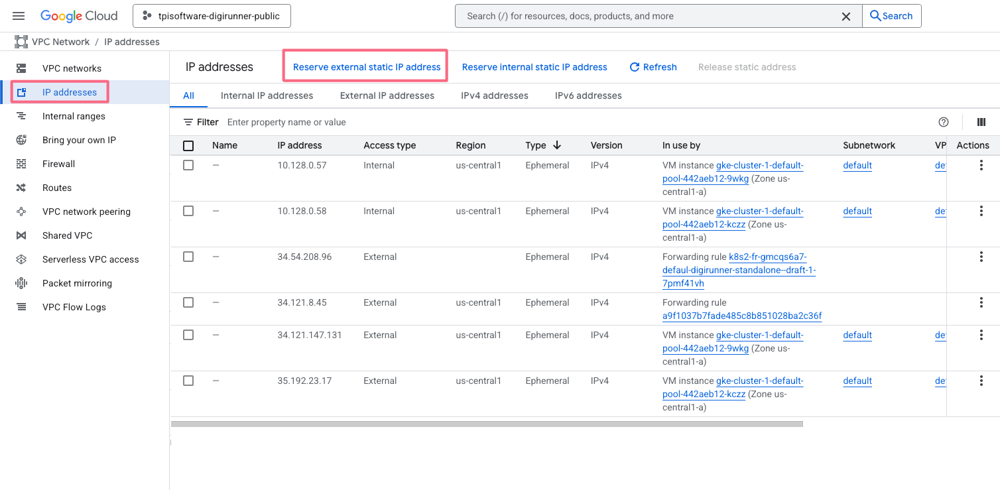

# Overview

digiRunner Enterprise API Management Platform features full API lifecycle management in compliance with OpenAPI specification and security standards of OAuth2.0 and OIDC. Tailored for Open Banking, Smart Government and enterprise system integration, it provides a secure environment for API management, analysis, deployment and more to empower API-First strategy..

For more information on digiRunner, visit the
[official digiRunner website](https://www.tpisoftware.com/en/products/digirunner).

## About Google Click to Deploy

digiRunner software stacks on Kubernetes, packaged by Google.

## Architecture


This solution installs a single instance of digiRunner on your Kubernetes
cluster.

The digiRunner Pod is managed by a Deployment, with the number of replicas set
to 1. The digiRunner Pod uses a PersistentVolume to store data and an Ingress to
expose the UI to external users. If you need to limit access to the digiRunner UI,
you must configure Google Cloud firewall rules.

# Installation

## Quick install with Google Cloud Marketplace

Get up and running with a few clicks! To install this digiRunner app to a Google
Kubernetes Engine cluster using Google Cloud Marketplace, follow the
[on-screen instructions](https://console.cloud.google.com/marketplace/product/tpisoftware-digirunner-public/digirunner).

### Cluster creation

click "cluster creation page".


Remember Name "cluster-1"


Set the size to 1.


Set Machine type to "e2-standard-2 (2 vCPU, 1 core, 8 GB memory)", then click Create.


### Deploy Deploy application

Select the newly created "cluster-1" and then click Create.


### Update Cluster Label

After selecting the newly created cluster-1, click "Labels"


Label data as follows

``` textile
Key：goog-partner-solution
Value：isol_plb32_0014m00001xkhxaqae_whuoy6xpkjmbfwmb5m37lngscbjkmnbi
```



### Log in to digiRunner

Click on Ingress URL.


digiRunner installation complete, please wait another 15~20 minutes, then press the "X.X.X.X/dgrv4/login URL".


Login information is as follows.

``` textile
Username：manager
User password：manager123
```


After logging in, the system screen is as follows.


## Command-line instructions

You can use [Google Cloud Shell](https://cloud.google.com/shell/) or a local
workstation to complete these steps.

[](https://console.cloud.google.com/cloudshell/editor?cloudshell_git_repo=https://github.com/tpisoftware-hub/digiRunner-HA&cloudshell_open_in_editor=README.md)

### Prerequisites

#### Set up command-line tools

You'll need the following tools in your environment. If you are using Cloud
Shell, `gcloud`, `kubectl`, Docker, and Git are installed in your environment by
default.

-   [gcloud](https://cloud.google.com/sdk/gcloud/)
-   [kubectl](https://kubernetes.io/docs/tasks/tools/install-kubectl/)
-   [docker](https://docs.docker.com/install/)
-   [git](https://git-scm.com/book/en/v2/Getting-Started-Installing-Git)
-   [helm](https://helm.sh/)

Configure `gcloud` as a Docker credential helper:

```shell
gcloud auth configure-docker
```

#### Create a Google Kubernetes Engine cluster

Create a cluster from the command-line. If you already have a cluster that you
want to use, skip this step.

```shell
export CLUSTER=digirunner-cluster
export ZONE=us-west1-a
export MACHINE=n2d-standard-2
```

```shell
gcloud container clusters create "$CLUSTER" --zone "$ZONE" --num-nodes=2 --machine-type="$MACHINE"   --labels=goog-partner-solution=isol_plb32_0014m00001xkhxaqae_whuoy6xpkjmbfwmb5m37lngscbjkmnbi
```

#### Configure `kubectl` to connect to the cluster

```shell
gcloud container clusters get-credentials "$CLUSTER" --zone "$ZONE"
```

#### Clone this repo

Clone this repo and its associated tools repo:

```shell
git clone https://github.com/tpisoftware-hub/digiRunner-HA
```

#### Install the Application resource definition

An Application resource is a collection of individual Kubernetes components,
such as Services, Deployments, and so on, that you can manage as a group.

To set up your cluster to understand Application resources, run the following
command:

```shell
kubectl apply -f "https://raw.githubusercontent.com/GoogleCloudPlatform/marketplace-k8s-app-tools/master/crd/app-crd.yaml"
```

You need to run this command once for each cluster.

The Application resource is defined by the
[Kubernetes SIG-apps](https://github.com/kubernetes/community/tree/master/sig-apps)
community. The source code can be found on
[github.com/kubernetes-sigs/application](https://github.com/kubernetes-sigs/application).

### Install the app

Navigate to the `digiRunner` directory:

```shell
cd digiRunner-HA
```

#### Configure the app with environment variables

Choose an instance name and
[namespace](https://kubernetes.io/docs/concepts/overview/working-with-objects/namespaces/)
for the app. In most cases, you can use the `default` namespace.

```shell
export APP_INSTANCE_NAME=digirunner-ha
export NAMESPACE=default
```

Configure the container images:

```shell
export IMAGE_TAG=4.7.1-1-00
export IMAGE_DGR_REPO="gcr.io/tpisoftware-digirunner-public/digirunner/digirunner"
export IMAGE_COMPOSER_REPO="gcr.io/tpisoftware-digirunner-public/digirunner/composer"
```

Download service account key.


Apply the service account key:

```shell
export REPORTING_SECRET=$(kubectl apply -f service-account-key.yaml | grep '^secret/' | awk '{print $1}' | cut -d'/' -f2)
```

The image above is referenced by
[tag](https://docs.docker.com/engine/reference/commandline/tag). We recommend
that you pin each image to an immutable
[content digest](https://docs.docker.com/registry/spec/api/#content-digests).
This ensures that the installed app always uses the same images, until
you are ready to upgrade.

#### Expand the manifest template

Use `helm template` to expand the template. We recommend that you save the
expanded manifest file for future updates to your app.

```shell
helm template $APP_INSTANCE_NAME chart/digiRunner \
  --namespace $NAMESPACE \
  --set "environment.dgr.image.repo=$IMAGE_DGR_REPO" \
  --set "environment.dgr.image.tag=$IMAGE_TAG" \
  --set "environment.composer.image.repo=$IMAGE_COMPOSER_REPO" \
  --set "environment.composer.image.tag=$IMAGE_TAG" \
  --set "environment.reportingSecret=$REPORTING_SECRET" \
  > ${APP_INSTANCE_NAME}_manifest.yaml
```

#### Apply the manifest to your Kubernetes cluster

Use `kubectl` to apply the manifest to your Kubernetes cluster. This
installation creates:

-   An Application resource, which collects all the deployment resources into
    one logical entity.
-   A PersistentVolume and PersistentVolumeClaim. If an installation is deleted, the
    volume is not deleted with it. If you delete an installation, then recreate it
    with the same name, the new installation will use the same PersistentVolume. As
    a result, there will be no app initialization, and the old configuration will
    be used.
-   An Services, which expose digiRunner UI
-   An Ingress, which exposes the digiRunner UI externally.

```shell
kubectl apply -f "${APP_INSTANCE_NAME}_manifest.yaml" --namespace "${NAMESPACE}"
```

#### View the app in the Google Cloud Console

To get the Cloud Console URL for your app, run the following command:

```shell
echo "https://console.cloud.google.com/kubernetes/application/${ZONE}/${CLUSTER}/${NAMESPACE}/${APP_INSTANCE_NAME}"
```

To view the app, open the URL in your browser.

# Auto Scaling

Go to "Kubernetes Engine" -> "Workloads", find the item ending with "sec-dgr", and then click on it.


Go to "Details"


Click "Configure" on "Horizontal Pod Autoscaler".


Configure as shown below.


Configuration is successfully completed, as shown below.


# Using the app

## Sign in to your new digiRunner instance

digiRunner installation is complete. Please wait 15-20 minutes, then sign in to digiRunner and retrieve the HTTP address.

```shell
EXTERNAL_IP=$(kubectl -n$NAMESPACE get ingress -l "app.kubernetes.io/name=$APP_INSTANCE_NAME" \
  -ojsonpath="{.items[0].status.loadBalancer.ingress[0].ip}")

MASTER_POD=$(kubectl -n$NAMESPACE get pod -oname | sed -n /\\/$APP_INSTANCE_NAME/s.pods\\?/..p)

echo http://$EXTERNAL_IP/dgrv4/login
```

# DNS Setup

1.Log in to your domain management platform

- Log in to the website where you bought your domain (e.g., GoDaddy, Namecheap, PChome).

- Find the “Domain Management” or “DNS Management” page.

2.Set up the main DNS records

The two most common records:

- A Record – points your domain to your website server IP
  - Host/Name: @
  - Value: your server IP (e.g., 123.123.123.123)
- CNAME Record – points the www subdomain to your main domain
  - Host/Name: www
  - Value: example.com
  
In most cases, just setting these two is enough.

3.Save and wait for propagation

- Save your settings. DNS changes usually take 30 minutes to 24 hours to fully propagate.
- You can check if it’s working by using ping yourdomain.com or an online DNS tool.

# Configure the TLS certificate for digiRunner

## Set a static IP address

1.Enter VPC networks.


2.IP addresses -> Reserve external static IP address.


3.Name set to dgrstaticip and Type set to Global, then click Reserve.


4.The static IP address for dgrstaticip has been successfully created


## Set up Load balancing

1.Enter Load balancing.


2.Search for digirunner, then click Edit.


3.Delete "Port: 80 item".


4.Click "Add Frontend IP and port".


5.Set Protocol to HTTPS, IP Address to dgrstaticip, create a Certificate, and check "Enable HTTP to HTTPS redirect".


6.Click "Host and path rules".


7.Click "Advanced host and path rule (URL redirect, URL rewrite)", then click Update.


8.Please wait another 15 to 20 minutes, then use a browser to connect to the DNS Hostname of the TLS certificate.

digiRunner URL example:

``` textile
https://{DNS Hostname}/dgrv4/login
```

Login information is as follows.

``` textile
Username：manager
User password：manager123
```


9.After logging in, the system screen is as follows.


# Configure SMTP

1. Click System Configs -> Setting in the system.


2. Search for the "SMTP" keyword (as shown in the image below) and modify it according to your own configuration.


# Deleting your digiRunner installation

> Warning: The following command deletes digiRunner from your cluster.

```shell
kubectl delete -f ${APP_INSTANCE_NAME}_manifest.yaml --namespace $NAMESPACE
```
